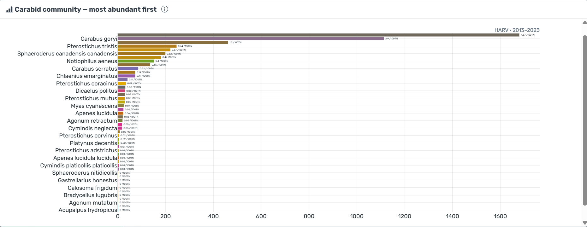
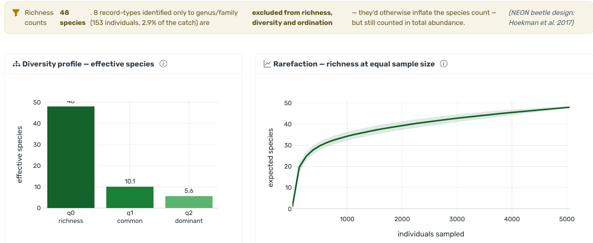
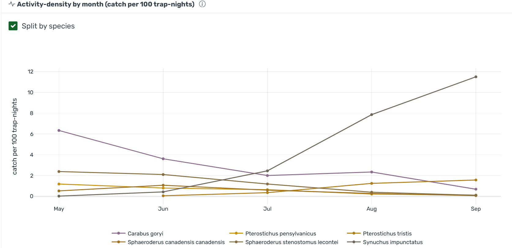
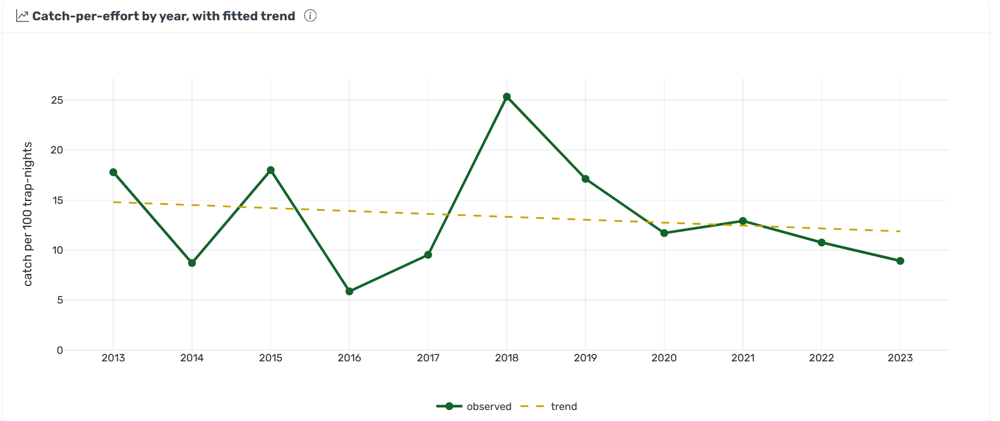
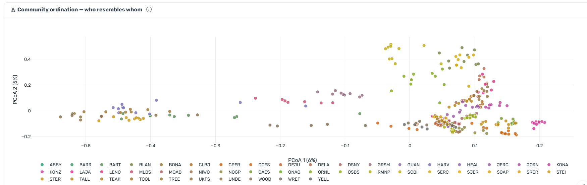
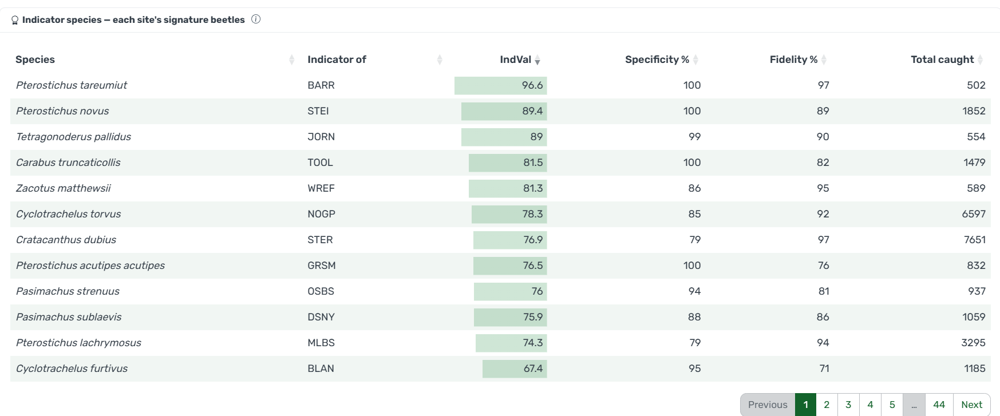

# 🪲 NEON Ground Beetle Tracker

An interactive R/Shiny app for exploring **ground beetle (Carabidae) biodiversity**
across the National Ecological Observatory Network, from NEON data product
[**DP1.10022.001 — Ground beetles sampled from pitfall traps**](https://data.neonscience.org/data-products/DP1.10022.001).

Ground beetles are a textbook **bioindicator** — they respond fast to habitat,
disturbance, and climate — so their richness, diversity, and seasonal activity
tell a rich story about each NEON site. This is the carabid sibling of the
[NEON Small Mammal Tracker](https://github.com/tgilbert14/NEON-Small-Mammal-Tracker-App),
sharing its Desert Data Labs house style and **bundle-first** data pattern.

> ▶️ **Live app:** **<https://tgilbert14.github.io/NEON-Ground-Beetle-Tracker/>**
> — a landing page that launches the live dashboard (hosted on Posit Connect Cloud).
>
> ✅ All **46 NEON terrestrial sites** are bundled from **real**
> DP1.10022.001 records (`data/sites/*.rds`), with the cross-site index, ordination
> and indicators precomputed to `data/precomputed.rds` for a near-instant boot. The
> tiny `data-sample/beetle_demo.csv` remains only as an offline fallback. Re-pull or
> extend the bundle anytime with `scripts/refresh_data.R`.

## A look inside

<table>
  <tr>
    <td width="50%"><br><sub><b>Overview</b> — every species ranked by abundance, labelled with catch per 100 trap-nights.</sub></td>
    <td width="50%"><br><sub><b>Diversity</b> — Hill numbers (q0/q1/q2) and rarefaction, with the species-vs-higher-taxa QA note.</sub></td>
  </tr>
  <tr>
    <td width="50%"><br><sub><b>Seasonality</b> — activity-density by month, split by species to reveal each one's peak.</sub></td>
    <td width="50%"><br><sub><b>Trends</b> — inter-annual catch-per-effort with a fitted trend: the insect-decline view.</sub></td>
  </tr>
  <tr>
    <td width="50%"><br><sub><b>Biogeography</b> — a Bray–Curtis PCoA placing every site×year community; sites cluster by biome.</sub></td>
    <td width="50%"><br><sub><b>Indicator species</b> — each site's signature beetles by Dufrêne–Legendre IndVal.</sub></td>
  </tr>
</table>

## What it does

| Tab | What you see |
| --- | --- |
| **Overview** | Carabid community composition — species ranked by abundance and catch-per-100-trap-nights, plus "meet the beetles" natural-history cards. |
| **Diversity** | Hill numbers (q0/q1/q2 effective species), Hurlbert rarefaction (richness at equal sample size), and species accumulation across bouts. |
| **Seasonality** | Activity-density by month (catch per 100 trap-nights), overall or split by the top species. |
| **Trends** | Inter-annual catch-per-effort with a fitted OLS trend line and a plain-English verdict (rising / declining / flat, with %/yr and p-value) — the insect-decline view. |
| **Biogeography** | A national map sized by carabid richness — or by a chosen species' local abundance (a range map); a **PCoA community ordination** (Bray–Curtis) showing which site×year communities resemble each other; an **indicator-species table** (Dufrêne–Legendre IndVal) naming each site's signature beetles; and a sortable comparison table. |
| **About** | Data product, methods, and the live data-source note. |

Pick a site and it loads automatically (the date window snaps to that site's real coverage); tap a marker on the map to jump there, or hit **Surprise me** for a random site. Choose a **Compare with** site to overlay any second site on the Diversity and Seasonality charts — a prairie next to a forest.

## How the numbers work

- **Effort-normalised abundance.** Counts are expressed as **catch per 100 trap-nights**
  (effort = the sum of unique plot × bout trap-night totals), so sites and windows
  with different sampling effort compare fairly. This also absorbs NEON's protocol
  changes (4→3 traps/plot in 2018; 10→6 plots/site in 2023).
- **Diversity** — Hill numbers (Hill 1973; Jost 2006); individual-based rarefaction
  with an analytic SD (Hurlbert 1971; Heck et al. 1975); sample-based species
  accumulation averaged over random bout orders (Gotelli & Colwell 2001).
- **Taxonomy** — the real bundle reconciles parataxonomist IDs with the
  authoritative **expert taxonomist** IDs (`assemble_beetles()` in `R/helpers.R`).
- **Species vs. higher taxa (QA/QC).** NEON records aren't all named to species —
  some stop at genus (`Bembidion sp.`) or family (`Carabidae`). Counting those as
  distinct species **inflates richness and diversity**, so every richness-type
  metric (richness, Hill numbers, rarefaction, accumulation, ordination, indicator
  species) uses **species-level records only** — keyed on NEON's authoritative
  `taxonRank` (carried from the expert-taxonomist table), with a scientific-name
  test (`is_species_level()`) as backstop when rank is absent — while total
  **abundance** still counts every beetle trapped. The Diversity tab reports how
  many records are excluded. Design ref: Hoekman et al. 2017, *Ecosphere* 8(4):e01744;
  indicator value: Dufrêne & Legendre 1997.

## Run it locally

```r
install.packages(c(
  "shiny", "bslib", "bsicons", "shinyjs", "shinycssloaders",
  "plotly", "dplyr", "tidyr", "RColorBrewer", "leaflet", "DT", "htmltools"
))
# neonUtilities is OPTIONAL — only for the live-fetch path / refresh script:
# install.packages("neonUtilities")

shiny::runApp()
```

The app opens to a splash; pick a state + site and **Load this site**, or open the
Biogeography map and tap a marker. All 46 bundled sites load instantly.

## Build the real data bundle

```r
Rscript scripts/refresh_data.R
```

This downloads DP1.10022.001 per site, assembles the carabid long table (expert-ID
reconciliation + per-trap-night effort), and writes `data/sites/<SITE>.rds`. The app
prefers a real bundle over the demo automatically, and the source badge turns green.

## Project layout

```
global.R                  libraries, theme, data loaders, national site index, lazy NEON fetch
ui.R                      bslib dashboard (sidebar + hero + tabs)
server.R                  data flow and all outputs
R/helpers.R               analytical engine (Hill numbers, rarefaction, accumulation, assemble_beetles)
R/site_metadata.R         site code -> name / state / domain / coords / bio
scripts/refresh_data.R    build the per-site beetle bundle from NEON
data/sites/<SITE>.rds     bundled per-site carabid data (real NEON — 46 sites)
data/precomputed.rds      cached cross-site index + ordination + indicators (fast boot)
data-sample/beetle_demo.csv  offline demo fallback (NOT real NEON data)
www/styles.css            theme CSS
manifest.json             Posit Connect Cloud deploy manifest (bundle-only)
```

## Built by Desert Data Labs

Tucson, AZ · custom data apps & analytics → **desertdatalabs@gmail.com**
Data: NEON DP1.10022.001. Not affiliated with NEON, Battelle, or the NSF. An
educational data-exploration tool.
